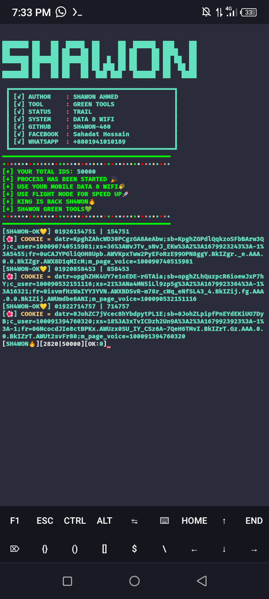

# GREEN-LOVER💚

✨Free Tools Enjoy And Share With Friend💗

💗Follow My GitHub And Enjoy This Tools✨🌝

# Install Mathod🔥

       pkg install python

       pkg install git

       pip2 install requests

       pip2 install mechanize

       pip install requests

       pip install mechanize

       rm -rf GREEN-LOVER

       git clone https://github.com/Sh4won460/GREEN-LOVER

       cd GREEN-LOVER

       python GREEN-LOVER1.py

# OK IDZ PROVE✨🌺

